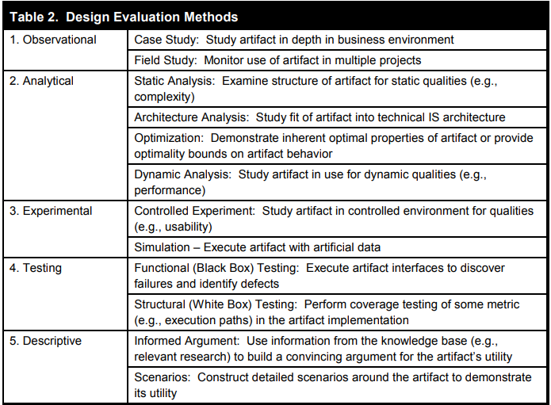
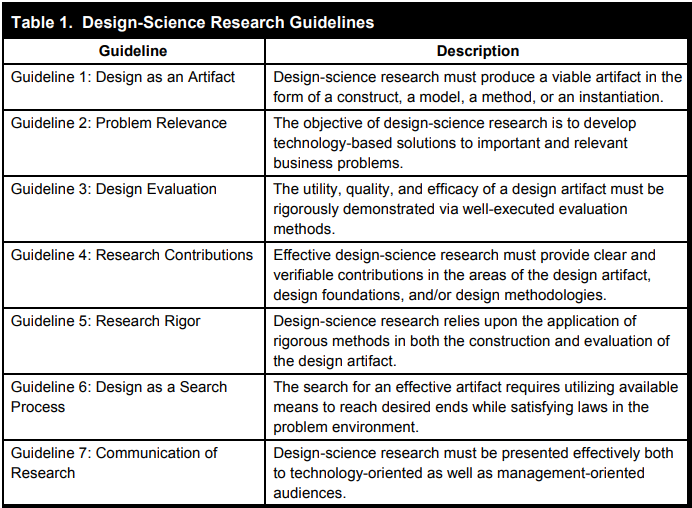

# Wie kann ich DSR für meine Bachelorarbeit nutzen?

Durch den DSR Ansatz identifiziere ich das Problem und die Ziele, anschließend gebe ich einen EInstieg in das Thema und erkläre theoretische grundlagen.
Danach führe ich einen iterativen prozess durch indem ich die anforderungen erweitere und das Artefakt immer weiter entwickeln und verbessere.

- Warum ist das Problem relevant?
- Was wurde bisher in der Forschung gemacht und was nicht?
- Was ist das Ziel des Artefakts? - Requirements

### Guidline 1: Design as Artifact
- Klare und verständliche Beschreibung des Artefakts
    Was genau wurde entwickelt?
    Welches Problem wird damit gelöst?
- Schnittstelle zum Nutzer ist wichtig 
- Es muss nicht Marktreif sein sondern nur ein Konzept => welches man Evaluieren kann => Prototyp, als Validierung des Konzepts
- Entwicklung und das Produkt sollten wissenschaftlich fundiert beschrieben werden
- Problem so darstellen, dass die Lösung daraus offensichtlich wird
- Problem identifikation beeinflusst Qualität der Lösung
- Modell mittels z.b. ERM oder UML

### Guideline 2: Problem Relevance
✅ Dein Artefakt muss ein real existierendes, relevantes Problem lösen – z. B. ineffiziente oder fehlerhafte Code-Reviews in Software-Repositories.
✅ Deine Forschung sollte sich nicht nur auf Theorien stützen, sondern eine konkrete, innovative Lösung (z. B. LLM-gestützte Codebewertung) entwickeln.
✅ Definiere klar den aktuellen Zustand (Problem) und den gewünschten Zustand (Lösung), den dein System ermöglicht.
✅ Betrachte nicht nur die technische Umsetzung, sondern auch, wie Entwickler und Organisationen das System effektiv nutzen können.
✅ Dein Artefakt sollte evaluiert werden, um seinen praktischen Nutzen für die IS-Community zu demonstrieren.

### Guideline 3: Evaluation 
✅ Dein LLM-gestütztes Bewertungssystem muss anhand klarer Metriken evaluiert werden (z. B. Genauigkeit der Bewertungen, Geschwindigkeit, Entwicklerakzeptanz).
✅ Eine iterative Evaluation hilft, das System kontinuierlich zu verbessern.
✅ Wähle geeignete Evaluierungsmethoden (z. B. experimentelle Vergleiche mit bestehenden Code-Review-Tools).
✅ Berücksichtige auch weiche Faktoren wie Benutzerfreundlichkeit und Darstellung, um die Akzeptanz des Systems zu erhöhen.

### Guideline 4: Research Contributionsn
✅ Dein Forschungsbeitrag kann sich auf eines oder mehrere dieser drei Felder beziehen:
    Ein neuartiges LLM-basiertes Codebewertungssystem (Artefakt)
    Ein neues Modell zur Codeanalyse mit LLMs (Foundation)
    Neue Evaluationsmethoden für LLM-gestützte Softwareanalysen (Methodology)
✅ Definiere klar, welchen Beitrag deine Arbeit liefert und wie sie zur Wissensbasis von DSR beiträgt.
✅ Falls möglich, belege die praktische Relevanz durch eine Implementierung oder einen Prototyp.

### Guideline 5: Research Rigor
✅ Methodische Strenge ist essenziell für die Validität deiner Forschung, aber darf die Praxisrelevanz nicht beeinträchtigen.
✅ Wähle wissenschaftlich fundierte Methoden für die Entwicklung & Evaluierung deines LLM-basierten Codebewertungssystems.
✅ Nutze klare Metriken, um die Leistungsfähigkeit und den Nutzen des Artefakts zu messen.
(✅ Berücksichtige sowohl technische als auch menschliche Faktoren bei der Bewertung deines Systems.)
✅ Ergänze DSR durch empirische Methoden, um herauszufinden, wie gut das System von Entwicklern akzeptiert wird.

### Guideline 6: Design as a Search Process
✅ Dein Multiagentensystem sollte iterativ entwickelt und durch Tests verbessert werden.
✅ Die beste Lösung ist oft nicht berechenbar – dein Ziel ist eine praktikable, nützliche Lösung.
✅ Definiere klare Means (Methoden), Ends (Ziele) und Laws (Einschränkungen) für dein System.
✅ Wähle geeignete Evaluierungsmethoden, um den Nutzen deines Systems vergleichbar zu machen (z. B. mit existierenden Code-Review-Techniken).
✅ Falls dein System noch nicht perfekt ist, ist das normal – eine schrittweise Verbesserung gehört zum DSR-Prozess.
### Guideline 7: Communication
✅ Technische Details für Entwickler & Forscher bereitstellen → Dokumentation, Algorithmen, Evaluierungsmethoden.
✅ Praxisnahe Beschreibung für Manager → Fokus auf Problemlösung, Nutzen und Wirtschaftlichkeit.
✅ Klare Strukturierung der Arbeit → Kernbotschaften im Hauptteil, detaillierte technische Infos in Anhängen oder separaten Dokumenten.
✅ Ermöglichung von Reproduzierbarkeit → Nachvollziehbare Prozesse und klare Evaluierungsmethoden.

